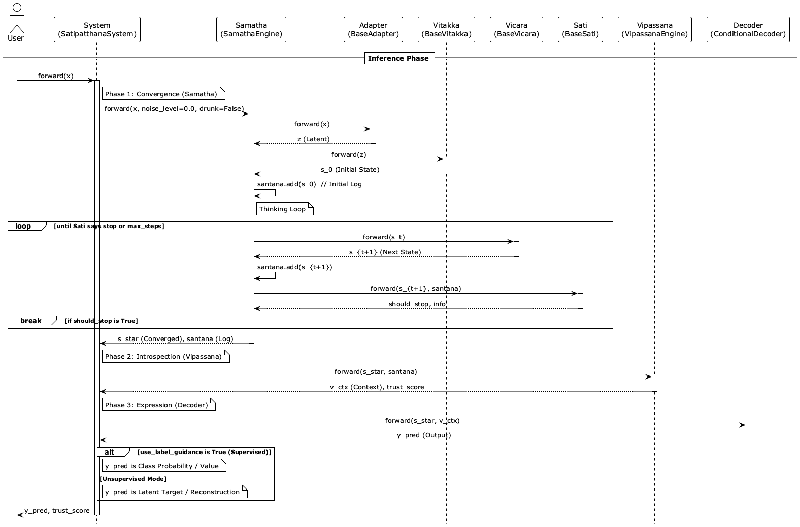

# Satipatthana Framework (Introspective Deep Convergence Architecture)

> **"From Chaos to Essence, with Awareness."**


**Satipatthana Framework** is an **introspective recursive attention architecture** designed for **converging to essential structures (Samatha)** from complex, noisy data, and **introspecting (Vipassana)** the process to explain its own confidence.

Instead of expanding information horizontally (generation), it implements a vertical deepening (insight) that reduces information entropy to reach a stable, meaningful state (Attractor), while maintaining awareness of its own reasoning process.

---

## What is Satipatthana?

A neural architecture that **converges** instead of **generates**, and **knows when it doesn't know**.

| Feature | Traditional Models | Satipatthana |
|:---|:---|:---|
| **Output** | Stream of tokens | Single purified state |
| **Inference** | Unbounded (autoregressive) | Bounded (fixed-point convergence) |
| **Self-Awareness** | None | Trust score (0.0–1.0) |
| **Explainability** | Attention heatmaps | Full thinking trajectory |

**Key Innovations:**

* **Three-Engine Architecture:** SamathaEngine (convergence) + VipassanaEngine (introspection) + ConditionalDecoder (expression)
* **4-Stage Curriculum Training:** Progressive training (Adapter → Samatha → Vipassana → Decoder)
* **O(1) Inference Cost:** Depends only on convergence steps, not input length
* **Modular & Type-Safe:** Easily swap components (CNN, LSTM, MLP, Transformer adapters)

---

## Architecture

### Inference Flow



### Training Overview (4-Stage Curriculum)


---

## Quick Start

### Installation

```bash
# This project uses uv as its package manager
uv sync
```

### Minimal Example (3 lines)

```python
import torch
from satipatthana.core.system import SatipatthanaSystem
from satipatthana.configs import SystemConfig

system = SatipatthanaSystem(SystemConfig.default(input_dim=784, latent_dim=64))
result = system(torch.randn(1, 784))
print(f"Output: {result.output.shape}, Trust: {result.trust_score.item():.3f}")
```

### Full Configuration Example

```python
import torch
from satipatthana.core.system import SatipatthanaSystem
from satipatthana.configs import SystemConfig, SamathaConfig, VipassanaEngineConfig
from satipatthana.configs import create_adapter_config, create_vicara_config, VitakkaConfig, StandardVipassanaConfig

config = SystemConfig(
    samatha=SamathaConfig(
        adapter=create_adapter_config("mlp", input_dim=784, latent_dim=64),
        vitakka=VitakkaConfig(num_probes=16),
        vicara=create_vicara_config("standard", latent_dim=64),
    ),
    vipassana=VipassanaEngineConfig(
        vipassana=StandardVipassanaConfig(context_dim=32),
    ),
)

system = SatipatthanaSystem(config)
result = system(torch.randn(1, 784))

print(f"Output shape: {result.output.shape}")
print(f"Converged state: {result.s_star.shape}")
print(f"Trust score: {result.trust_score.item():.3f}")  # 0.0-1.0
print(f"Thinking steps: {len(result.santana)}")
```

### Using Trust Scores

```python
result = system(input_data)

if result.trust_score > 0.8:
    prediction = result.output  # High confidence
else:
    print("Warning: Low confidence")
    # Trigger fallback, search, or abstain
```

### Data Format

Datasets must return a dictionary with `"x"` key:

```python
class MyDataset(Dataset):
    def __getitem__(self, idx):
        return {
            "x": self.data[idx],   # Required: input tensor
            "y": self.labels[idx]  # Optional: labels (Stage 1 guidance, Stage 3)
        }
```

For Stage 2 OOD training, use `VoidDataset`:

```python
from satipatthana.data import FilteredNoiseVoid

void_dataset = FilteredNoiseVoid(
    reference_data=train_data_tensor,
    shape=(input_dim,),
    length=5000,
    min_distance=0.3,
)
```

> See [docs/data_format.md](docs/data_format.md) for full specification.

### Training (4-Stage Curriculum)

```python
from satipatthana.train import SatipatthanaTrainer
from transformers import TrainingArguments

trainer = SatipatthanaTrainer(
    model=system,
    args=TrainingArguments(output_dir="./output", num_train_epochs=10),
    train_dataset=dataset,
    void_dataset=void_dataset,  # For Stage 2
)

results = trainer.run_curriculum(
    stage0_epochs=5,   # Adapter pre-training
    stage1_epochs=10,  # Samatha (convergence)
    stage2_epochs=5,   # Vipassana (meta-cognition)
    stage3_epochs=5,   # Decoder fine-tuning
)
```

---

## Concept & Philosophy

The name "Satipatthana" (念処) means "establishment of mindfulness", symbolizing the architecture's essence of discerning truth through self-observation and introspection.

**Satipatthana** is a three-phase cognitive architecture:

1. **Samatha (Convergent Thinking):** Converges chaotic input to a stable fixed-point through Vitakka (intentional initialization) and Vicara (refinement).
2. **Vipassana (Introspective Self-Awareness):** Monitors the thinking process (SantanaLog) to generate trust scores and context vectors.
3. **Conditional Decoding (Humble Expression):** Safe output that integrates state with "uncertainty awareness".

It implements Buddhist psychology concepts as engineering modules:

| Module | Buddhist Term | Engineering Concept | Function |
|:---|:---|:---|:---|
| **Vitakka** | 尋 (Initial Application) | **Semantic Initialization** | Generates meaningful initial state $S_0$ from concept probes |
| **Vicara** | 伺 (Sustained Application) | **Contractive Refinement** | Single-step state update towards fixed point |
| **Sati** | 正知 (Clear Comprehension) | **Convergence Check** | Monitors state change and determines stopping |
| **Santāna** | 相続 (Continuity) | **Thinking Trajectory** | Records state history for explainability |
| **Vipassana** | 観 (Insight) | **Meta-Cognition** | Evaluates reasoning quality and generates confidence |

> 📖 For detailed specifications, see [Japanese](docs/specification.md) / [English](docs/specification_en.md).
>
> 📜 For theoretical foundations, see [Japanese](docs/theory.md) / [English](docs/theory_en.md).

---

## Applications

| Domain | Problem | Satipatthana Advantage |
|:---|:---|:---|
| **Healthcare** | Noisy EEG/ECG signals | Extract stable physiological states with confidence scores |
| **Forensics** | Anomaly detection | Explainable anomalies with uncertainty-aware predictions |
| **UX/Psychology** | User intent analysis | Deep intent capture with reasoning trajectories |
| **Robotics** | Autonomous decisions | Stable decision-making with self-assessed confidence |
| **LLM Safety** | Hallucination detection | Use Vipassana to detect "confident lies" |

---

## Project Structure

```bash
.
├── docs/               # Documentation
│   ├── specification.md / specification_en.md  # Implementation spec (How)
│   ├── theory.md / theory_en.md                # Theoretical foundations (Why)
│   ├── diagrams/       # PlantUML diagrams and images
│   └── *.md            # Other guides (logging, training, workflow)
├── notebooks/          # Jupyter demos (MNIST, Fraud, Time Series)
├── satipatthana/
│   ├── configs/        # Type-safe configuration system
│   ├── components/     # Modular components
│   │   ├── adapters/   # Input adapters (MLP, CNN, LSTM, Transformer)
│   │   ├── augmenters/ # Input augmentation (Identity, Gaussian)
│   │   ├── vitakka/    # Semantic initialization
│   │   ├── vicara/     # Refinement modules
│   │   ├── refiners/   # Core refinement networks (MLP, GRU)
│   │   ├── sati/       # Convergence monitors
│   │   ├── vipassana/  # Meta-cognition
│   │   ├── decoders/   # Output decoders
│   │   └── objectives/ # Training objectives
│   ├── core/           # SamathaEngine, VipassanaEngine, SatipatthanaSystem
│   └── train/          # 4-Stage curriculum trainer
├── tests/              # Unit tests
└── pyproject.toml      # Project configuration (uv)
```

---

## Documentation

| Document | Description |
|:---|:---|
| [training_strategy.md](docs/training_strategy.md) | Training Strategy & Pattern Selection (A-F) |
| [workflow_guide.md](docs/workflow_guide.md) | Implementation Cookbook (Copy-Paste Code) |
| [data_format.md](docs/data_format.md) | Data Format & VoidDataset Specification |
| [specification_en.md](docs/specification_en.md) | Architecture Specification |
| [theory_en.md](docs/theory_en.md) | Theoretical Foundations |

---

## Notebook Demos

| Notebook | Description |
|:---|:---|
| `01_mnist_visual_convergence.ipynb` | Visualizes "purification" of noisy MNIST digits |
| `02_trust_score_explained.ipynb` | Deep dive into Trust Score mechanics and visualization |
| `03_fraud_detection_tutorial.ipynb` | **Full tutorial**: 4-Stage Curriculum + Pattern A (Isolation) strategy |

```bash
uv pip install "jupyterlab>=3" && jupyter lab
```

---

## Roadmap

* [x] **v1.0:** Theoretical Definition (Concept Proof)
* [x] **v2.x:** Core Implementation (Vitakka, Vicāra, Sati)
* [x] **v3.0:** Framework Refactoring (Modularization, Builder, HF Trainer)
* [x] **v4.0:** **Introspective Architecture** (Vipassana, SatipatthanaSystem, 4-Stage Curriculum)
* [ ] **Future:** NLP Integration (LLM Hallucination Detection)
* [ ] **Future:** Multi-Agent Satipatthana (Collaborative Insight)

---

## License

MIT License
