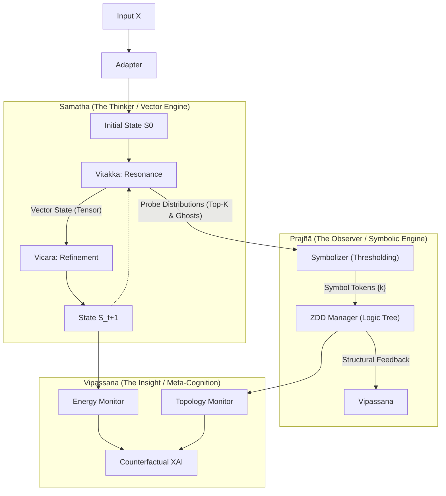

### 1 ネットワーク入出力の推移 (Tensor Flow Transformation)

「1. 並行世界の追加」に伴う、Vipassana内部のテンソル形状の変化（Folding $\to$ Unfolding）の詳細フローです。

**前提定義:**

* $B$: Batch Size (16)
* $W$: Beam Width (3)
* $T$: Time Steps (10)
* $D_{in}$: **下記セクション2で定義する「全特徴量の合計次元数」** (例: 140)
* $H$: LSTM Hidden Dim (128)

| 処理フェーズ | テンソル形状 (Shape) | 処理内容 |
| :--- | :--- | :--- |
| **0. Raw Log Input** | `[B, W, T, Raw_Dim]` | Samathaから渡される生ログ ($S, P, E, Z$)。 |
| **1. Feat Engineering** | **`[B, W, T, D_in]`** | 生ログから物理量($\Delta S$など)を計算・結合し、Vipassana入力ベクトル $x_t$ を作成。 |
| **2. Folding (畳み込み)** | **`[B * W, T, D_in]`** | `view(B * W, T, -1)`  並行世界 $W$ をバッチ次元に混ぜ、独立した時系列として扱う。 |
| **3. Encoder (LSTM)** | `[B * W, T, H]` | 時系列処理。全ステップの特徴を抽出。 |
| **4. Pooling (Last)** | **`[B * W, H]`** | 最終ステップ $T$ の隠れ状態 $h_T$ を取得 (Trajectory Summary)。 |
| **5. Unfolding (復元)** | **`[B, W, H]`** | `view(B, W, H)`  バッチ次元からビーム次元を分離し、グループ構造を復元。 |
| **6. Aggregation** | **`[B, 2H]`** | 世界間の整合性を計算。 Mean: `mean(dim=1)` $\to$ `[B, H]` Var: `var(dim=1)` $\to$ `[B, H]` これらを結合 (`cat`)。 |
| **7. Final MLP** | `[B, Out]` | MLP(`[B, 2H]`) $\to$ $\alpha$ (1), $V_{ctx}$ (64) |

-----

### 2 Vipassana特徴量の完全定義 (The Corrected Input Vector)

ご指摘の通り、前回のまとめでは $P, E, Z$ がリストから抜けていました。
Vipassana の LSTM に入力される **1ステップあたりの特徴量ベクトル $x_t$ (次元数 $D_{in}$)** の完全な構成要素は以下の通りです。

これにより、**内部状態・物理・文脈・プローブ・社会** の全情報が網羅されます。

$$
x_t = \text{Concat} \left(
\underbrace{S_t}_{\text{位置}},
\underbrace{\Delta S_t}_{\text{速度}},
\underbrace{\Delta^2 S_t}_{\text{加速度}},
\underbrace{P_{stats}}_{\text{プローブ}},
\underbrace{E_t}_{\text{苦}},
\underbrace{\text{Dist}(S_t, Z_{in})}_{\text{原点乖離}},
\underbrace{\|S_t - \mu_{beam}\|}_{\text{仲間外れ度}}
\right)
$$

**各要素のソースと計算:**

1. **$S_t$ (位置):**
      * ソース: Log `states`
      * そのまま入力。
2. **$\Delta S_t, \Delta^2 S_t$ (物理):**
      * ソース: Log `states` から差分計算。
      * 振動と移動方向の変化を捉える。
3. **$P_{stats}$ (プローブ):** **【修正: 追加】**
      * ソース: Log `probe_acts`
      * そのまま入力（または要約）。「何に惹かれているか」「迷いのエントロピー」を表す最重要項目。
4. **$E_t$ (エネルギー):** **【修正: 追加】**
      * ソース: Log `energies`
      * そのまま入力。その場所の「居心地の悪さ（勾配ノルム）」を表す。
5. **$\text{Dist}(S_t, Z_{in})$ (原点):** **【修正: $Z$の利用】**
      * ソース: Log `states` と `z_origin`
      * $Z_{in}$ そのものを入れると次元が無駄なので、\*\*「$S_t$ と $Z_{in}$ のユークリッド距離」\*\*を計算してスカラー値として入れます。「初期入力からどれだけ離れたか（妄想度）」を見ます。
6. **Deviation (社会):**
      * ソース: Log `states` (Beam次元での平均との差)
      * 「他の並行世界と比較して、自分が異端かどうか」を見ます。

-----

### まとめ

これでデータフローの全容が整合しました。

* **Log (保存するもの):** 計算済みの一次情報 ($S, P, E, Z$) を 4Dテンソルで。
* **Input (入力するもの):** Logから派生計算した物理量も含めた **"Full-Stack" 特徴量** を Folding して LSTM へ。

