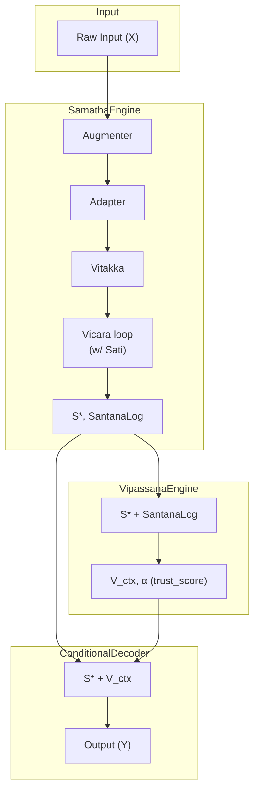
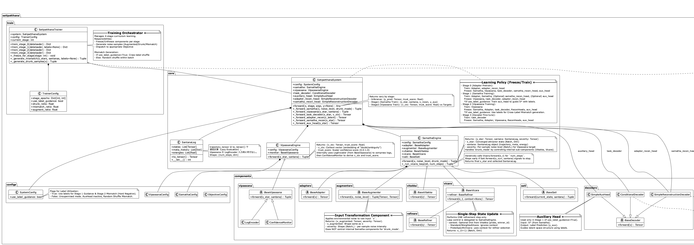
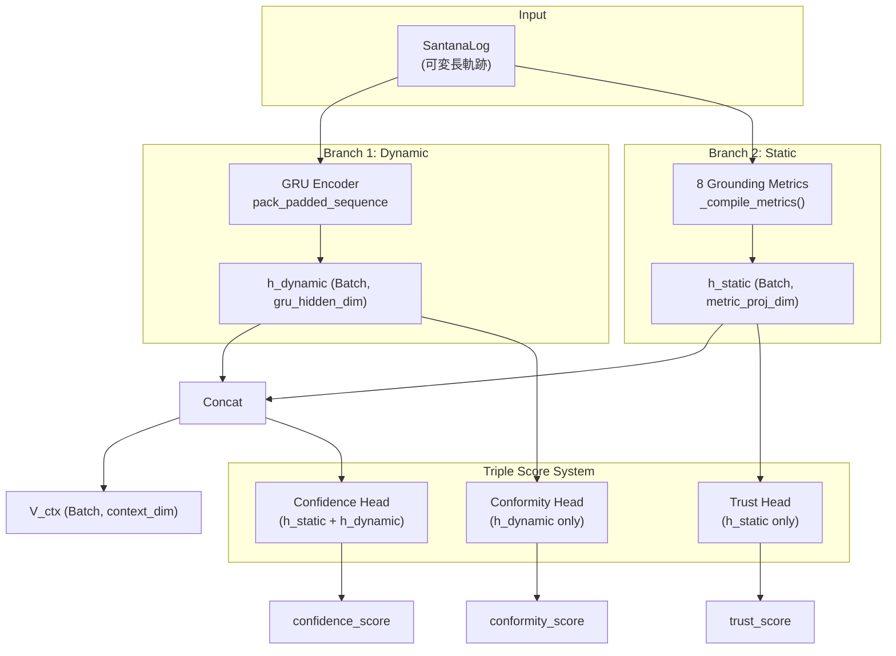

# Satipatthana Framework 仕様書

**Version:** 4.0 (The Three Engines & Guided Convergence)
**Status:** Active Specification

-----

## 1. 概要

### 1.1. 本文書の目的

本文書は Satipatthana Framework の**実装仕様書**である。以下を定義する：

* システムアーキテクチャとデータフロー
* コンポーネントのインターフェースと責務
* 数学的定式化（更新則、損失関数）
* 学習カリキュラム
* ハイパーパラメータ

理論的背景と設計思想については [theory.md](theory.md) を参照。

### 1.2. 想定読者

* **MLエンジニア** — フレームワークの実装・拡張
* **研究者** — 実験の再現
* **コードレビュアー** — システム挙動の理解

### 1.3. 前提知識

* 深層学習の基礎（PyTorch）
* Attention機構への理解
* 不動点反復法（あれば望ましい）

-----

## 2. 用語と記号

### 2.1. 主要記号

| 記号 | 型 | 説明 |
|:---|:---|:---|
| $X$ | Tensor (Batch, *) | 生入力データ |
| $z$ | Tensor (Batch, $d$) | Adapter後の潜在ベクトル |
| $S_t$ | Tensor (Batch, $d$) | 反復 $t$ における潜在状態 |
| $S^*$ | Tensor (Batch, $d$) | 収束した不動点状態 |
| $S_0$ | Tensor (Batch, $d$) | Vitakkaからの初期状態 |
| $P_k$ | Tensor ($d$,) | $k$ 番目の概念プローブベクトル |
| $V_{ctx}$ | Tensor (Batch, $c$) | Vipassana文脈ベクトル |
| $\alpha$ | Tensor (Batch, 1) | 信頼度スコア (0.0–1.0) |
| $Y$ | Tensor (Batch, output_dim) | 最終出力 |
| $\mathcal{T}$ | SantanaLog | 思考軌跡 $[S_0, S_1, \dots, S^*]$ |

### 2.2. ハイパーパラメータ記号

| 記号 | 説明 | 推奨範囲 |
|:---|:---|:---|
| $d$ | 潜在空間の次元 | 64–256 |
| $c$ | Vipassana文脈次元 | 32–128 |
| $K$ | 概念プローブ数 | 8–32 |
| $T$ | Vicara最大ステップ数 | 6–20 |
| $\beta$ | 状態更新の慣性 | 0.3–0.7 |
| $\epsilon$ | 収束判定閾値 (Sati) | 1e-4 |
| $\lambda_r$ | 再構成損失の重み | 0.1–0.3 |
| $\lambda_g$ | Guidance損失の重み | 0.1–0.5 |

-----

## 3. システムアーキテクチャ

本フレームワークは、3つの主要エンジン（Samatha, Vipassana, Decoder）と、それらを構成するモジュラーコンポーネント群によって構成される。

### 3.1. データフロー概要



### 3.2. クラス図



### 3.3. Engine 1: SamathaEngine

**役割:** 世界モデル。いかなる入力も「意味のある点」に収束させる。

**入力:** Raw Data `X` (Batch, *)
**出力:**

* `S*` (Batch, Dim): 収束した潜在状態
* `SantanaLog`: 思考軌跡を記録したオブジェクト
* `severity` (Batch,): ノイズ強度（Vipassanaターゲット用）

**構成コンポーネント:**

| コンポーネント | 役割 |
|:---|:---|
| **Adapter** | 生入力を潜在空間へ投影・正規化 |
| **Augmenter** | 入力にノイズ/摂動を付与（学習時） |
| **Vitakka** | プローブベースの初期状態 $S_0$ 生成 |
| **Vicara** | 1ステップの状態更新 ($S_t \rightarrow S_{t+1}$) |
| **Sati** | 収束判定・停止制御 |

**特徴:** タスクやラベルには依存せず、「構造の抽出」のみを行う。`drunk_mode` フラグにより内部的な摂動制御が可能。

### 3.4. Engine 2: VipassanaEngine

**役割:** メタ認知。Samathaの思考プロセス（ログ）が健全だったか監視する。

**入力:** `S*` (Batch, Dim) + `SantanaLog`
**出力:** `VipassanaOutput` dataclass:

* `v_ctx` (Batch, context_dim): デコーダーへのヒント情報（「迷い」の埋め込み表現）
* `trust_score` (Batch, 1): OOD検出スコア（static metricsのみ）
* `conformity_score` (Batch, 1): 軌跡整合性スコア（dynamic contextのみ）
* `confidence_score` (Batch, 1): 総合信頼度スコア（両方を使用）

**構成:** `StandardVipassana` (GRU + Grounding Metrics + Triple Score Heads)

### 3.5. Engine 3: ConditionalDecoder

**役割:** 表現。状態と文脈を統合して、人間にわかる形にする。

**入力:** `S*` (Batch, Dim) + `V_ctx` (Batch, context_dim) → Concatenate → (Batch, Dim + context_dim)
**出力:** `Y` (Batch, output_dim)

**特徴:** 「自信がない時は、自信がないような出力（分散を広げる等）」が可能になり、**謙虚な表現**を実現する。**推論時に使用される唯一のDecoder**。

### 3.6. Reconstruction Heads & AuxHead (学習補助)

学習の安定化を目的とした補助モジュール。**推論時には使用されない。**

* **`adapter_recon_head`** (Stage 0用): Adapterの出力 `z` から元入力を再構成
* **`samatha_recon_head`** (Stage 1用): 収束点 `S*` から元入力を再構成
* **`AuxHead`** (Stage 1用): `S*` (次元: $d$) からタスク予測を行う補助ヘッド

**重要: AuxHead と ConditionalDecoder の関係**

| モジュール | 入力次元 | 用途 | Stage 3での扱い |
|:---|:---|:---|:---|
| `AuxHead` | $d$ (`S*`のみ) | Stage 1のGuidance学習 | **破棄** |
| `ConditionalDecoder` | $d + c$ (`S*` ⊕ `V_ctx`) | Stage 3以降の推論 | 新規学習 |

Stage 1の `AuxHead` と Stage 3の `ConditionalDecoder` は**入力次元が異なるため、物理的に別モジュール**である。`AuxHead` の重みは Stage 3 には転移されず、`ConditionalDecoder` はゼロから学習される。

-----

## 4. コンポーネント詳細

### 4.0. コンポーネント I/O サマリー

| コンポーネント | 入力 | 出力 | インターフェース |
|:---|:---|:---|:---|
| **Adapter** | $X$ (Batch, *) | $z$ (Batch, $d$) | `BaseAdapter` |
| **Augmenter** | $X$ (Batch, *) | $(X_{aug}, severity)$ | `BaseAugmenter` |
| **Vitakka** | $z$ (Batch, $d$) | $(S_0, metadata)$ | `BaseVitakka` |
| **Vicara** | $S_t$ (Batch, $d$), context | $S_{t+1}$ (Batch, $d$) | `BaseVicara` |
| **Sati** | $S_t$, $\mathcal{T}$ | $(should\_stop, info)$ | `BaseSati` |
| **Vipassana** | $S^*$, $\mathcal{T}$ | `VipassanaOutput` (v_ctx, trust, conformity, confidence) | `BaseVipassana` |
| **ConditionalDecoder** | $S^* \oplus V_{ctx}$ (Batch, $d+c$) | $Y$ (Batch, output\_dim) | `BaseDecoder` |

### 4.1. Adapter

**機能:** 生の外部入力 $X_{raw}$ を潜在空間へ投影・正規化する。

* **Interface:** `BaseAdapter`
* **実装:** `MlpAdapter`, `CnnAdapter`, `LstmAdapter`, `TransformerAdapter`
* **入力:** 生データ $X$ (Batch, *)
* **出力:** 潜在ベクトル $z \in \mathbb{R}^d$

### 4.2. Augmenter

**機能:** 入力に対して環境ノイズや摂動を加える。

* **Interface:** `BaseAugmenter`
* **実装:** `IdentityAugmenter`, `GaussianNoiseAugmenter`
* **入力:** 生データ $X$ (Batch, *)
* **出力:** `(x_augmented, severity)` — severityはサンプルごとのノイズ強度 $\in [0, 1]$

### 4.3. Vitakka

**機能:** 潜在空間内での初期アトラクタ探索。

1. **Active Resonance:** 概念プローブ群 $\mathbf{P}$ と入力の共鳴度を計算
2. **$S_0$ Generation:** 勝者プローブをQueryとして初期状態を生成

* **Interface:** `BaseVitakka`
* **入力:** 潜在ベクトル $z$ (Batch, $d$)
* **出力:** `(s0, metadata)` — metadataには `winner_id`, `probs` 等を含む

### 4.4. Vicara

**機能:** 1ステップの状態更新。

$$S_{t+1} = (1 - \beta) S_t + \beta \Phi(S_t)$$

* **Interface:** `BaseVicara`
* **実装:** `StandardVicara`, `WeightedVicara`, `ProbeSpecificVicara`
* **入力:** 現在の状態 $S_t$ (Batch, $d$)、Vitakkaからのオプショナルなcontext
* **出力:** 次の状態 $S_{t+1}$ (Batch, $d$)
* **責務:** 単一ステップの更新のみ。ループ制御はSamathaEngineに委譲。

**バリエーション:**

| クラス | 説明 |
|:---|:---|
| `StandardVicara` | 単一Refinerで状態更新。最もシンプル |
| `WeightedVicara` | 複数Refinerの重み付け合成 |
| `ProbeSpecificVicara` | Vitakkaの勝者Probe/確率に基づきRefinerを選択 |

### 4.5. Sati

**機能:** 収束判定と停止制御。

* **Interface:** `BaseSati`
* **実装:** `FixedStepSati`, `ThresholdSati`
* **入力:** 現在の状態 $S_t$ (Batch, $d$)、軌跡 $\mathcal{T}$
* **出力:** `(should_stop: bool, info: dict)`
* **Stop Condition:** 状態変化エネルギー $||S_{t+1} - S_t||$ が閾値 $\epsilon$ を下回った時点で停止

### 4.6. Vipassana

**機能:** Samathaの思考ログを監視し、論理的整合性と信頼度を評価するメタ認知モジュール。**dual-branch アーキテクチャ**（GRU + Grounding Metrics）による包括的な分析と **Triple Score System** を使用。

* **Interface:** `BaseVipassana`
* **実装:** `StandardVipassana`（GRUベース、8 Grounding Metrics、Triple Score）
* **入力:**
  * 収束状態 $S^*$ (Batch, $d$)
  * 軌跡 $\mathcal{T}$ (SantanaLog、$S_0$ とサンプル毎の `convergence_steps` を含む)
  * プローブベクトル $\mathbf{P}$ (オプション、$K \times d$)
  * 再構成誤差 (オプション、Batch, 1)
* **出力:** `VipassanaOutput` dataclass:
  * `v_ctx` (Batch, $c$): 文脈ベクトル（dynamic + static）
  * `trust_score` (Batch, 1): OOD検出スコア（metricsのみ、GRU勾配なし）
  * `conformity_score` (Batch, 1): 軌跡整合性スコア（dynamic contextのみ、GRU勾配あり）
  * `confidence_score` (Batch, 1): 総合信頼度スコア（両方、GRU勾配あり）

**Triple Score System:**

| スコア | 入力 | GRU勾配 | 目的 |
|:---|:---|:---|:---|
| `trust_score` | static metrics (h_static) | ✗ | 純粋なOOD検出 |
| `conformity_score` | dynamic context (h_dynamic) | ✓ | 軌跡プロセス異常検出 |
| `confidence_score` | h_static + h_dynamic | ✓ | 総合的な信頼度評価 |

この分離により、GRUが適切な勾配を受けながら、純粋なOOD検出能力も維持される。

**アーキテクチャ:**



**8 Grounding Metrics:**

| # | 特徴量 | 説明 | 正規化 | OOD時の挙動 |
|:---|:---|:---|:---|:---|
| 1 | `velocity` | $\|S_T - S_{T-1}\|$ (最終移動量) | log1p | 高 = 不安定 |
| 2 | `avg_energy` | mean($\|S_t - S_{t-1}\|^2$) マスク付き | log1p | 高 = 粗い収束 |
| 3 | `convergence_steps` | $t / T_{max}$ (正規化された思考時間) | linear | 高 = 収束が遅い |
| 4 | `min_dist` | $\min(\|S^* - P\|)$ (親和性) | log1p | 高 = 未知の概念 |
| 5 | `entropy` | プローブ分布のエントロピー | none | 高 = 曖昧 |
| 6 | `s0_min_dist` | $\min(\|S_0 - P\|)$ (初期OOD度) | log1p | **高 = 収束前からOOD** |
| 7 | `drift_magnitude` | $\|S^* - S_0\|$ (総移動量) | log1p | **大 = アトラクタに引き込まれた** |
| 8 | `recon_error` | 再構成損失 | log1p | **高 = 幻覚** |

**Grounding Metrics** (`s0_min_dist`, `drift_magnitude`, `recon_error`) は、そうでなければ既知の領域に収束してしまうOOD入力の検出に重要である。最終状態 $S^*$ では失われる「収束前」の状態を捉える。

**可変長サポート:** GRUエンコーダは `pack_padded_sequence` を使用してサンプル毎の `convergence_steps` を処理し、パディングノイズが動的コンテキストのエンコーディングに影響しないようにする。

**フォールバック戦略:** 推論時に $\alpha < \text{threshold}$ の場合：

* デフォルト回答（"I don't know"）を出力
* または出力分布の分散（Variance）を最大化
* または検索トリガー/回答拒否を発動

-----

## 5. 数理モデル

### 5.1. Samatha Phase (収束)

**状態更新則:**
$$S_{t+1} = (1 - \beta) S_t + \beta \Phi(S_t)$$

**収束保証:** $\beta \in (0, 1)$ の慣性更新により、写像の実効リプシッツ定数が低減される。$\Phi$ のリプシッツ定数が $L$ の場合、合成写像の実効定数は $L_{eff} = (1 - \beta) + \beta L$ となる。$L < 1$ の場合、または安定性損失が縮小を促進する場合、不動点への収束が促進される。

**停止条件 (Sati):**
$$\text{Stop if } ||S_{t+1} - S_t|| < \epsilon_{sati}$$

### 5.2. Vipassana Phase (内省)

思考ログ $\mathcal{T} = [S_0, \dots, S^*]$ と **Grounding Metrics** から **Triple Score** を算出する。

**文脈ベクトル:**
$$V_{ctx} = [h_{dynamic}, h_{static}] \in \mathbb{R}^{c}$$

ここで $h_{dynamic}$ はGRUエンコーダ出力、$h_{static}$ は8メトリクスの射影。

**Triple Score System:**

1. **Trust Score** (OOD検出、GRU勾配なし):
$$\text{trust\_score} = \sigma(\text{TrustHead}(h_{static})) \in [0, 1]$$

2. **Conformity Score** (軌跡整合性、GRU勾配あり):
$$\text{conformity\_score} = \sigma(\text{ConformityHead}(h_{dynamic})) \in [0, 1]$$

3. **Confidence Score** (総合評価、GRU勾配あり):
$$\text{confidence\_score} = \sigma(\text{ConfidenceHead}([h_{static}, h_{dynamic}])) \in [0, 1]$$

**8 Grounding Metrics ($h_{static}$ の基盤):**

* $v$ = velocity（最終状態変化率）
* $e$ = 軌跡全体の平均エネルギー
* $t$ = 収束ステップ数（正規化）
* $d_{S^*}$ = $S^*$ からプローブへの最小距離
* $H$ = プローブ分布のエントロピー
* $d_{S_0}$ = $S_0$ からプローブへの最小距離 (**Grounding**)
* $\delta = \|S^* - S_0\|$ = ドリフト量 (**Grounding**)
* $r$ = 再構成誤差 (**Grounding**)

**ターゲット:** 全3スコアに同一ターゲットを使用

* Clean: $\hat{\alpha} = 1.0$
* Augmented: $\hat{\alpha} = 1.0 - \text{severity}$
* Mismatch/Drunk: $\hat{\alpha} = 0.0$
* Void (OOD): $\hat{\alpha} = 0.0$

### 5.3. Loss Function (Stage-wise)

学習ステージごとに目的関数が切り替わる。

* **Stage 0 (Adapter Pre-training):** Reconstruction Only
    $$\mathcal{L}_0 = \mathcal{L}_{recon}(X, \hat{X}_{adapter})$$

* **Stage 1 (Samatha Training):** Stability + Reconstruction + (Optional) Label Guidance
    $$\mathcal{L}_1 = ||S_T - S_{T-1}||^2 + \lambda_r \mathcal{L}_{recon} + \lambda_g \mathcal{L}_{task}(y, \text{AuxHead}(S^*))$$

* **Stage 2 (Vipassana Training):** Triple Score BCE
    $$\mathcal{L}_2 = \text{BCE}(\text{trust}, \hat{\alpha}) + \text{BCE}(\text{conformity}, \hat{\alpha}) + \text{BCE}(\text{confidence}, \hat{\alpha})$$

* **Stage 3 (Decoder Fine-tuning):** Task Specific Loss
    $$\mathcal{L}_3 = \mathcal{L}_{task}(y, \text{Decoder}(S^*, V_{ctx}))$$

-----

## 6. データ構造仕様

### 6.1. SantanaLog

収束過程の状態履歴を記録するオブジェクト。

```python
class SantanaLog:
    def add(self, state: Tensor) -> None:
        """状態を軌跡に追加"""

    def to_tensor(self) -> Tensor:
        """軌跡をテンソル化 (Steps, Batch, Dim)"""

    def __len__(self) -> int:
        """記録されたステップ数"""
```

### 6.2. SystemOutput

```python
class SystemOutput(NamedTuple):
    output: Tensor              # デコード結果
    s_star: Tensor              # 収束した潜在状態
    v_ctx: Tensor               # Vipassanaの文脈ベクトル
    trust_score: Tensor         # OOD検出スコア (0.0〜1.0)
    conformity_score: Tensor    # 軌跡整合性スコア (0.0〜1.0)
    confidence_score: Tensor    # 総合信頼度スコア (0.0〜1.0)
    santana: SantanaLog         # 思考軌跡
    severity: Tensor            # ノイズ強度
    aux_output: Optional[Tensor] = None      # Stage 1 AuxHead出力
    recon_adapter: Optional[Tensor] = None   # Stage 0 再構成
    recon_samatha: Optional[Tensor] = None   # Stage 1 再構成
```

-----

## 7. 処理フロー

### 7.1. 推論シーケンス図


### 7.2. 推論フロー

```python
def inference(x: Tensor) -> SystemOutput:
    # Phase 1: Samatha (収束)
    s_star, santana, severity = samatha_engine(x, run_augmenter=False)

    # Phase 2: Vipassana (内省) - VipassanaOutput を返す
    vipassana_output = vipassana_engine(s_star, santana)
    # vipassana_output.v_ctx: 文脈ベクトル
    # vipassana_output.trust_score: OOD検出
    # vipassana_output.conformity_score: 軌跡整合性
    # vipassana_output.confidence_score: 総合信頼度

    # Phase 3: Decode (表現)
    output = conditional_decoder(concat(s_star, vipassana_output.v_ctx))

    return SystemOutput(output, s_star, vipassana_output, santana, severity)
```

### 7.3. SamathaEngine内部フロー

```python
def samatha_forward(x, noise_level=0.0, run_augmenter=True):
    # Augment (学習時のみ)
    if run_augmenter:
        x_aug, severity = augmenter(x, noise_level)
    else:
        x_aug, severity = x, zeros(batch_size)

    # Adapt
    z = adapter(x_aug)

    # Vitakka: 初期状態生成
    s0, metadata = vitakka(z)

    # Vicara loop with Sati
    santana = SantanaLog()
    s_t = s0
    santana.add(s_t)

    for step in range(max_steps):
        s_t = vicara(s_t, context=metadata)
        santana.add(s_t)

        should_stop, _ = sati(s_t, santana)
        if should_stop:
            break

    return s_t, santana, severity
```

-----

## 8. 学習カリキュラム (4-Stage)

### 8.1. 学習ポリシー

| Stage | Name | Train対象 | Freeze対象 | 目的関数 |
|:---|:---|:---|:---|:---|
| **0** | Adapter Pre-training | Adapter, adapter_recon_head | 他すべて | Reconstruction Loss |
| **1** | Samatha Training | Adapter, Vitakka, Vicara, Sati, (samatha_recon_head, AuxHead) | Vipassana, TaskDecoder | Stability + Recon + (Guidance) |
| **2** | Vipassana Training | Vipassana | 他すべて | Triple Score BCE |
| **3** | Decoder Fine-tuning | TaskDecoder | 他すべて | Task Specific Loss |

### 8.2. 反復戦略

| モード | 説明 | ユースケース |
|:---|:---|:---|
| **Fixed Steps** | 常に $T$ 回反復 | 学習（勾配の安定性） |
| **Early Stopping** | $\|S_{t+1} - S_t\| < \epsilon$ で停止 | 推論（効率性） |
| **Hybrid** | 最小ステップ数実行後、早期停止を許可 | 安定性と効率のバランス |

**推奨:**

* **学習時:** Fixed steps ($T = 10$) で勾配フローを安定化
* **推論時:** Early stopping ($\epsilon = 10^{-4}$) で効率化
* **切替:** `SatiConfig.mode` で戦略を切り替え

### 8.3. Stage遷移基準

| 遷移 | 基準 | フォールバック |
|:---|:---|:---|
| 0 → 1 | Reconstruction lossがプラトー | 固定エポック (例: 5) |
| 1 → 2 | Stability loss $< 10^{-3}$ | 固定エポック (例: 10) |
| 2 → 3 | Vipassana BCE $< 0.3$ | 固定エポック (例: 5) |

**Early Stopping:** ステージごとに検証損失を監視。`patience` エポック改善がなければ次のステージへ遷移。

### 8.4. Stage 2 ノイズ生成戦略

Vipassanaにメタ認知能力を習得させるための4種類のデータ生成戦略:

1. **Environmental Ambiguity (Augmented Path)**
   * 入力データへのノイズ付与
   * Target: `1.0 - severity`

2. **Internal Dysfunction (Drunk Path)**
   * SamathaEngine内部の摂動（`drunk_mode=True`）
   * 具体的実装: Vicara内のDropout率を上げる、Refinerの重みに一時的ノイズを加算、Vitakkaの温度パラメータを乱す等
   * Target: `0.0`

3. **Logical Inconsistency (Mismatch Path)**
   * バッチ内でS*とSantanaLogをシャッフル
   * Target: `0.0`

4. **Out-of-Distribution (Void Path)**
   * 真のOODサンプル（VoidDataset、FilteredNoiseVoid）を使用
   * Grounding Metricsの学習に重要：OODサンプルはプローブから遠い位置（高い `s0_min_dist`）から開始
   * Target: `0.0`

**バッチ構成 (推奨):**

| パス | 割合 | 目的 |
|:---|:---|:---|
| Clean | 20% | ベースライン信頼度 |
| Augmented | 20% | 環境的不確実性 |
| Drunk | 20% | 内部機能不全の検知 |
| Mismatch | 20% | 論理的不整合の検知 |
| Void | 20% | OOD検出（Grounding Metrics） |

-----

## 9. ハイパーパラメータ

### 9.1. モデルアーキテクチャ

| Key | Symbol | Recommended | Description |
|:---|:---|:---|:---|
| `latent_dim` | $d$ | 64-256 | 潜在空間の次元 |
| `context_dim` | $c$ | 32-128 | Vipassana出力の次元 |
| `num_probes` | $K$ | 8-32 | Vitakkaのプローブ数 |
| `max_steps` | $T$ | 6-20 | Vicaraの最大ステップ数 |

### 9.2. 学習戦略

| Key | Symbol | Recommended | Description |
|:---|:---|:---|:---|
| `sati_threshold` | $\epsilon$ | 1e-4 | 収束判定閾値 |
| `beta` | $\beta$ | 0.3-0.7 | 状態更新の慣性パラメータ |
| `guidance_weight` | $\lambda_g$ | 0.1-0.5 | (Stage 1) Guidance Lossの強さ |
| `recon_weight` | $\lambda_r$ | 0.1-0.3 | Reconstruction Lossの重み |

-----

## 10. 応用と学習戦略

教師ありタスクにおいては **Stage 1 Guidance (AuxHead)** を積極的に使用し、Samathaの収束空間をタスク向けに最適化する。

| 応用タスク | Stage 1 Strategy | Stage 2 Role | Stage 3 Decoder |
|:---|:---|:---|:---|
| **教師あり分類** | Guidance (CE Loss) | Hallucination Check | Classifier (Softmax) |
| **教師あり回帰** | Guidance (MSE Loss) | Uncertainty Est. | Regressor (Linear) |
| **異常検知** | Reconstruction Only | Anomaly Score (最終出力) | Identity |
| **構造発見** | Stability Only | Boundary Detection | None |

-----

## 11. アーキテクチャの拡張性

`SystemConfig` と各種 `ComponentConfig` を使用して、コンポーネントを自由に組み合わせることができる。

### 11.1. タスク別カスタマイズ例

| タスク | Adapter | Augmenter | Vicara | Decoder |
|:---|:---|:---|:---|:---|
| **時系列異常検知** | LSTM | Gaussian | Standard | Reconstruction |
| **画像分類** | CNN | Identity | Standard | Conditional |
| **対話意図推定** | Transformer | Identity | ProbeSpecific | Conditional |
| **ロボット制御** | MLP | Gaussian | Weighted | Conditional |

### 11.2. Config Example

```python
from satipatthana.configs import SystemConfig, SamathaConfig, VipassanaEngineConfig
from satipatthana.configs import create_adapter_config, create_vicara_config

config = SystemConfig(
    samatha=SamathaConfig(
        adapter=create_adapter_config("mlp", input_dim=784, latent_dim=64),
        augmenter=AugmenterConfig(type=AugmenterType.GAUSSIAN, max_noise_std=0.3),
        vitakka=VitakkaConfig(num_probes=16),
        vicara=create_vicara_config("standard", latent_dim=64),
        sati=SatiConfig(type=SatiType.THRESHOLD, threshold=1e-4),
    ),
    vipassana=VipassanaEngineConfig(
        vipassana=StandardVipassanaConfig(context_dim=32),
    ),
    use_label_guidance=True,
)
```
