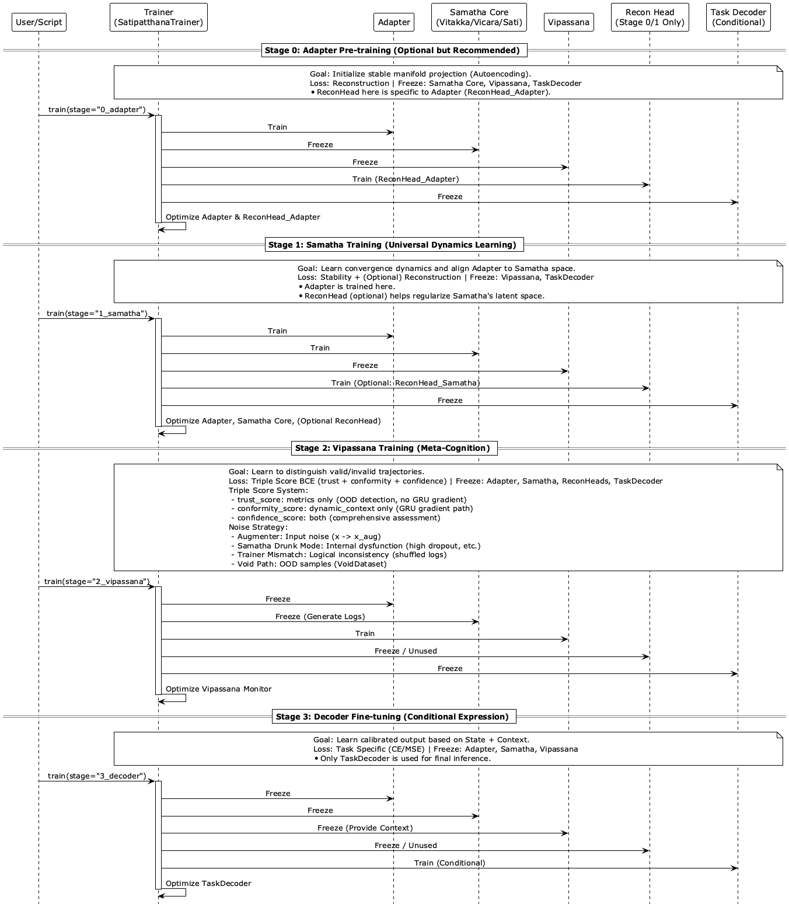
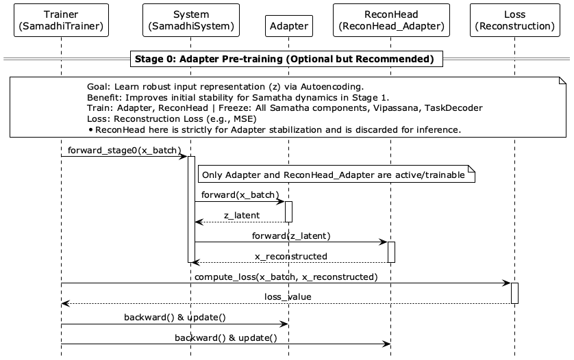
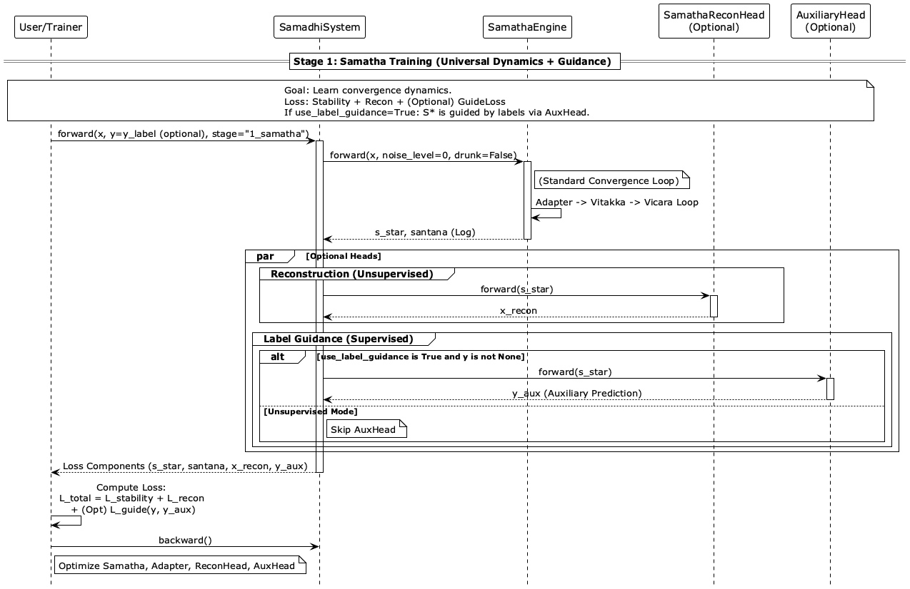
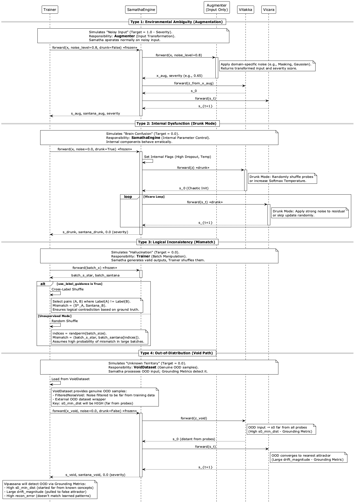
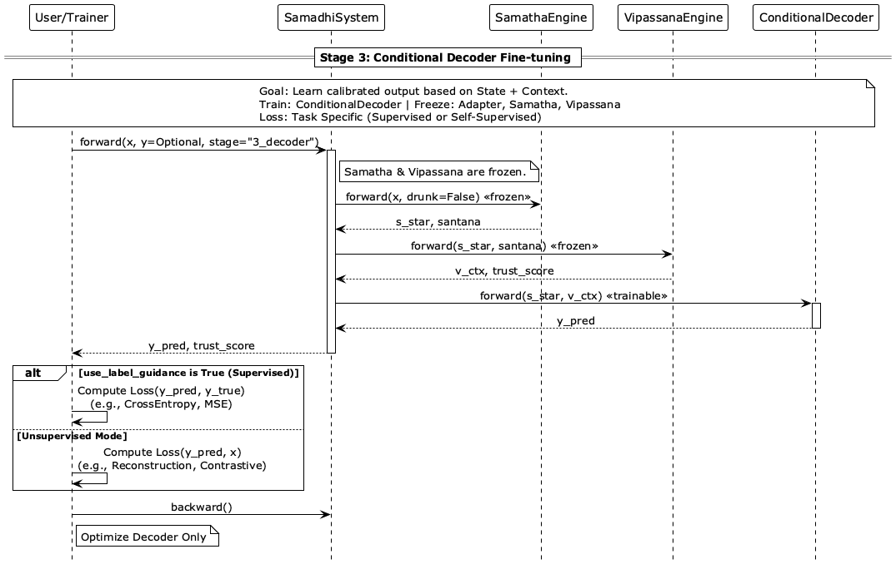
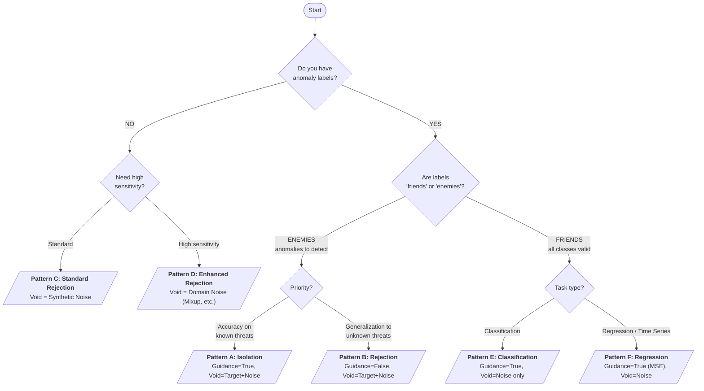
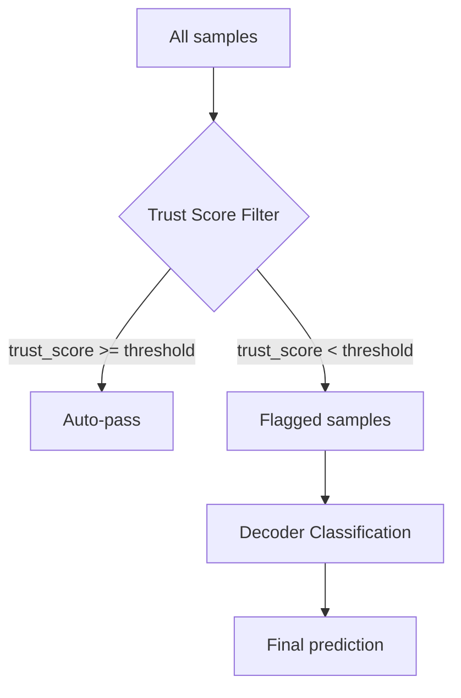
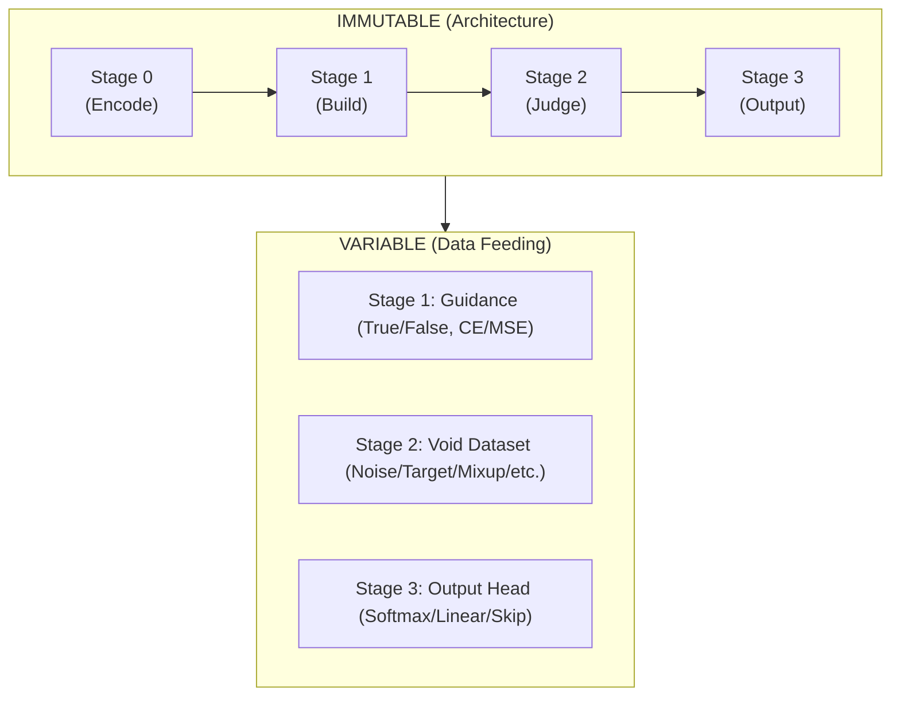

# Satipatthana Training Strategy Guide

This document defines the **4-Stage Curriculum Training** strategy for the **Satipatthana Framework**. The core insight: the architecture is immutable—only the **data feeding strategy** changes between tasks.

---

## 1. The Immutable Structure

Satipatthana's training pipeline consists of exactly **4 stages** that never change, regardless of the task:

```text
Stage 0: Adapter Pre-training     → Learn input encoding
Stage 1: Samatha Training         → Build world model (attractors)
Stage 2: Vipassana Training       → Define anomaly boundaries
Stage 3: Decoder Fine-tuning      → Map to task output
```



| Stage | Name | Trainable Components | Frozen Components | Universal Objective |
|:------|:-----|:---------------------|:------------------|:--------------------|
| **0** | Adapter Pre-training | Adapter, AdapterReconHead | All others | Reconstruction |
| **1** | Samatha Training | Adapter, Vitakka, Vicara, Sati, SamathaReconHead, (AuxHead) | Vipassana, Decoder | Stability + Recon + (Guidance) |
| **2** | Vipassana Training | Vipassana | All others | Triple Score BCE |
| **3** | Decoder Fine-tuning | ConditionalDecoder | All others | Task-specific |

**Key Principle:** The stages, loss functions, and trainable components are fixed. What varies is:

- **Stage 1:** Whether to use label guidance (and what loss type)
- **Stage 2:** What constitutes "Void" (the enemy)
- **Stage 3:** Output head configuration

---

## 2. The Strategy Matrix

This matrix is the **single source of truth** for configuring Satipatthana across all tasks.

### Core Strategy Patterns

| Pattern | Task Category | Stage 1: World Model | Stage 2: Anomaly Definition | Stage 3: Output | When to Use |
|:--------|:--------------|:---------------------|:----------------------------|:----------------|:------------|
| **A. Isolation** | Supervised Anomaly | All data, Guidance=**True** | Clean=Normal, Void=**Target+Noise** | Binary (Softmax) | Known threat patterns, sufficient labels |
| **B. Rejection** | Supervised Anomaly | Normal only, Guidance=**False** | Clean=Normal, Void=**Target+Noise** | Trust only / Binary | Unknown threats, generalization priority |
| **C. Standard Rejection** | Unsupervised Anomaly | All data, Guidance=**False** | Clean=All, Void=**Synthetic Noise** | Trust only | No labels, baseline anomaly detection |
| **D. Enhanced Rejection** | Unsupervised Anomaly | All data, Guidance=**False** | Clean=All, Void=**Domain Noise** | Trust only | High sensitivity required |
| **E. Classification** | Multi-class | All data, Guidance=**True** (CE) | Clean=**All classes**, Void=**Noise** | N-class (Softmax) | Standard classification tasks |
| **F. Regression** | Regression / Time Series | All data, Guidance=**True** (MSE) | Clean=All, Void=**Noise** | Linear (MSE) | Continuous value prediction |

### Pattern Selection Guide

#### Supervised Anomaly Detection (Labels Available)

| Pattern | Philosophy | Stage 1 Data | Stage 1 Guidance | Best For |
|:--------|:-----------|:-------------|:-----------------|:---------|
| **A. Isolation** ★Recommended | "Separate territories for Normal and Anomaly" | All (Normal + Anomaly) | **True** | High accuracy on known threats |
| **B. Rejection** | "Only Normal has a home; everything else is rejected" | Normal only | **False** | Detecting novel/unknown attack variants |

> **Key Insight:** Pattern A creates an "anomaly attractor" — Samatha learns where anomalies converge. Pattern B has no anomaly attractor — anomalies wander and are rejected by trajectory analysis.

#### Unsupervised Anomaly Detection (No Labels)

| Pattern | Void Strategy | Best For |
|:--------|:--------------|:---------|
| **C. Standard** | Gaussian / Uniform noise | General-purpose anomaly detection |
| **D. Enhanced** | Domain-specific noise (Mixup, CutPaste, Time-warp) | Image defects, Time series anomalies |

> **Domain Noise Examples:**
>
> - Images: CutPaste, Mixup, Random erasing
> - Time Series: Time-warp, Spike injection, Segment reversal
> - Tabular: Feature permutation, Interpolation

### Reading the Matrix

- **Stage 1 "World Model"**: Determines what attractors Samatha creates
  - `Guidance=True`: Teacher-guided sorting (attractors aligned with labels)
  - `Guidance=False`: Natural self-organization (attractors emerge from data structure)

- **Stage 2 "Anomaly Definition"**: Determines what Vipassana considers "bad"
  - `Clean`: What receives target α=1.0 (trusted)
  - `Void`: What receives target α=0.0 (rejected)

- **Stage 3 "Output"**: Task-specific head
  - Can be skipped if Trust Score alone is the output (pure anomaly detection)

### Void Definition Summary

| Task Type | Void Composition | Rationale |
|:----------|:-----------------|:----------|
| **Classification (E)** | Synthetic Noise only | All classes are "friends" — only chaos is enemy |
| **Anomaly Detection (A, B)** | **Target Labels** + Noise | Specific enemy + abstract enemy |
| **Anomaly Detection (C)** | Synthetic Noise only | No known enemy — reject chaos |
| **Anomaly Detection (D)** | Domain-specific Noise | Realistic pseudo-anomalies for high sensitivity |

> **"Target Labels"** = The class you want to detect (fraud, defect, disease, attack, etc.)

---

## 3. Stage-by-Stage Logic

### Stage 0: Foundation (Universal)



**Purpose:** Establish basic input-to-latent mapping before the Vitakka/Vicara loop.

**Configuration:** Always the same—train Adapter and AdapterReconHead with reconstruction loss.

$$\mathcal{L}_0 = \mathcal{L}_{recon}(X, \hat{X}_{adapter})$$

**Data:** All available data (labels not required).

---

### Stage 1: World Model Construction



**Purpose:** Build the "semantic landscape" of attractors in latent space.

$$\mathcal{L}_1 = \underbrace{||S_T - S_{T-1}||^2}_{\text{Stability}} + \lambda_r \underbrace{\mathcal{L}_{recon}}_{\text{Reconstruction}} + \lambda_g \underbrace{\mathcal{L}_{task}}_{\text{Guidance (optional)}}$$

#### Two Paradigms

| Paradigm | Guidance | Data | Attractor Formation | When to Use |
|:---------|:---------|:-----|:--------------------|:------------|
| **Teacher-Guided** | True | All data with labels | Separate attractors per class/value | Labels are reliable and meaningful |
| **Self-Organizing** | False | All data (labels ignored) | Natural clustering by data structure | No labels, or labels represent "enemies" |

**Critical Insight:** The choice here determines what Samatha considers "normal convergence":

- With Guidance: Each class has a designated home
- Without Guidance: Majority patterns dominate; minorities are orphaned

#### AuxHead vs ConditionalDecoder

| Module | Input | Purpose | Lifecycle |
|:-------|:------|:--------|:----------|
| `AuxHead` | S* only (dim=d) | Guide Stage 1 learning | **Discarded after Stage 1** |
| `ConditionalDecoder` | S* ⊕ V_ctx (dim=d+c) | Final inference | Trained in Stage 3 |

---

### Stage 2: Boundary Setting


**Purpose:** Teach Vipassana to distinguish "healthy thinking" from "pathological thinking."

$$\mathcal{L}_2 = \text{BCE}(\text{trust}, \hat{\alpha}) + \text{BCE}(\text{conformity}, \hat{\alpha}) + \text{BCE}(\text{confidence}, \hat{\alpha})$$

#### The Enemy Spectrum

| Enemy Type | Void Dataset | Target α | Detects |
|:-----------|:-------------|:---------|:--------|
| **Abstract (Noise)** | Gaussian / Uniform noise | 0.0 | Unknown unknowns, OOD |
| **Structural (Mixup)** | Interpolated samples | 0.0 | Ambiguous, boundary cases |
| **Specific (Target)** | Labeled anomalies (fraud, defect, disease) | 0.0 | Known threat patterns |
| **Behavioral (Drunk)** | Perturbed internal states | 0.0 | Process anomalies |

#### Four Noise Generation Paths



| Path | Mechanism | Target α | Purpose |
|:-----|:----------|:---------|:--------|
| **Clean** | Normal forward pass | 1.0 | Baseline for healthy process |
| **Augmented** | Input noise (severity s) | 1.0 - s | Graceful degradation |
| **Drunk** | Internal perturbation | 0.0 | Detect process anomalies |
| **Mismatch** | Shuffle S* and SantanaLog | 0.0 | Detect inconsistency |
| **Void** | OOD samples | 0.0 | Detect distribution shift |

**Drunk Path Implementations:**

- Increase Dropout rate in Vicara Refiner
- Add noise to Refiner weights
- Disturb Vitakka's temperature parameter

#### Triple Score System

| Score | Input | GRU Gradient | Use Case |
|:------|:------|:-------------|:---------|
| `trust_score` | Static metrics (8 Grounding Metrics) | No | Pure OOD detection |
| `conformity_score` | Dynamic context (GRU output) | Yes | Trajectory anomaly |
| `confidence_score` | Static + Dynamic | Yes | Comprehensive assessment |

**8 Grounding Metrics:** `s0_energy`, `s_star_energy`, `s0_min_dist`, `s_star_min_dist`, `delta_norm`, `drift_magnitude`, `num_steps`, `recon_error`

---

### Stage 3: Output Mapping



**Purpose:** Map converged state to task-specific output.

$$\mathcal{L}_3 = \mathcal{L}_{task}(y, \text{Decoder}(S^*, V_{ctx}))$$

| Task Type | Output Dim | Loss | Activation |
|:----------|:-----------|:-----|:-----------|
| Binary Classification | 2 | CrossEntropy | Softmax |
| Multi-class Classification | N | CrossEntropy | Softmax |
| Regression | 1 (or k) | MSE | Linear |
| Anomaly Detection | Skip | — | Trust Score is output |

**V_ctx Conditioning:** The Decoder receives not just S*, but also the "embedding of doubt" (V_ctx). This allows it to learn conditional behavior without filtered training data.

---

## 4. Decision Tree

Use this flowchart to determine your strategy:



### Quick Reference Questions

1. **"Should I use Guidance?"**
   - Yes, if labels represent the target output (class, value)
   - No, if labels represent enemies (anomalies to detect) or don't exist

2. **"What goes in Void?"**
   - Always include synthetic noise (Gaussian)
   - Add labeled anomalies if detecting specific threats
   - Add Mixup if boundary awareness matters

3. **"Can I skip Stage 3?"**
   - Yes, for pure anomaly detection (Trust Score is the output)
   - No, for classification/regression tasks

---

## 5. Implementation Patterns

### Pattern A: Isolation (Supervised Anomaly, High Accuracy)

> Examples: Fraud detection, Defect detection, Disease diagnosis

```python
from satipatthana.train import SatipatthanaTrainer
from satipatthana.data import VoidDataset, GaussianNoiseVoid

# Stage 1: All data with guidance (create separate attractors)
trainer.train_dataset = BinaryDataset(X_train, y_train)  # Normal + Anomaly
trainer.use_label_guidance = True

trainer.run_stage(1)

# Stage 2: Normal=Clean, Target+Noise=Void
normal_mask = y_train == 0
trainer.train_dataset = BinaryDataset(X_train[normal_mask], y_train[normal_mask])

target_data = torch.tensor(X_train[y_train == 1], dtype=torch.float32)
noise_data = GaussianNoiseVoid(shape=(input_dim,), length=1000).tensors
trainer.void_dataset = VoidDataset(torch.cat([target_data, noise_data]))

trainer.run_stage(2)

# Stage 3: Binary classifier
trainer.train_dataset = BinaryDataset(X_train, y_train)
trainer.run_stage(3)
```

### Pattern B: Rejection (Supervised Anomaly, Generalization)

> Examples: Novel attack detection, Rare disease screening

```python
# Stage 1: Normal only, no guidance (no anomaly attractor)
normal_mask = y_train == 0
trainer.train_dataset = BinaryDataset(X_train[normal_mask], y_train[normal_mask])
trainer.use_label_guidance = False

trainer.run_stage(1)

# Stage 2: Normal=Clean, Target+Noise=Void (same as Pattern A)
target_data = torch.tensor(X_train[y_train == 1], dtype=torch.float32)
noise_data = GaussianNoiseVoid(shape=(input_dim,), length=1000).tensors
trainer.void_dataset = VoidDataset(torch.cat([target_data, noise_data]))

trainer.run_stage(2)

# Stage 3: Optional (Trust Score alone may suffice)
# Inference: anomaly_score = 1.0 - trust_score
```

### Pattern C: Standard Rejection (Unsupervised Anomaly)

> Examples: Log monitoring, Sensor anomaly detection

```python
# Stage 1: All data, no guidance (majority forms attractors)
trainer.train_dataset = dataset  # May contain unknown anomalies
trainer.use_label_guidance = False

trainer.run_stage(1)

# Stage 2: All data=Clean, Synthetic Noise=Void
trainer.train_dataset = dataset
trainer.void_dataset = GaussianNoiseVoid(shape=(input_dim,), length=1000)

trainer.run_stage(2)

# Stage 3: Skip (Trust Score is the output)
# Inference: anomaly_score = 1.0 - trust_score
```

### Pattern D: Enhanced Rejection (Unsupervised, High Sensitivity)

> Examples: Image defect detection, Time series anomaly

```python
from satipatthana.data import MixupVoid, CutPasteVoid

# Stage 1: Same as Pattern C
trainer.train_dataset = dataset
trainer.use_label_guidance = False
trainer.run_stage(1)

# Stage 2: Domain-specific noise as Void
domain_noise = MixupVoid(dataset, alpha=0.5, length=1000)  # or CutPasteVoid for images
synthetic_noise = GaussianNoiseVoid(shape=(input_dim,), length=500)
trainer.void_dataset = ConcatDataset([domain_noise, synthetic_noise])

trainer.run_stage(2)
```

### Pattern E: Classification (Multi-class)

> Examples: MNIST, CIFAR, ImageNet

```python
# Stage 1: All classes with guidance
trainer.train_dataset = mnist_dataset  # All 10 classes
trainer.use_label_guidance = True

trainer.run_stage(1)

# Stage 2: ALL classes are Clean, only noise is Void
trainer.train_dataset = mnist_dataset
trainer.void_dataset = GaussianNoiseVoid(shape=(784,), length=5000)

trainer.run_stage(2)

# Stage 3: N-class softmax
trainer.train_dataset = mnist_dataset
trainer.run_stage(3)
```

### Pattern F: Regression / Time Series

> Examples: Price prediction, Demand forecasting

```python
# Stage 1: MSE guidance for continuous values
trainer.train_dataset = regression_dataset
trainer.use_label_guidance = True
trainer.guidance_loss_type = "mse"

trainer.run_stage(1)

# Stage 2: All data=Clean, Noise=Void
trainer.void_dataset = GaussianNoiseVoid(shape=(input_dim,), length=1000)

trainer.run_stage(2)

# Stage 3: Linear output (MSE loss)
trainer.run_stage(3)
```

---

## 6. Inference Strategies

### Two-Stage Inference (Recommended for Imbalanced Tasks)



**Benefits:**

- Efficiency: 99%+ samples auto-processed
- Imbalance mitigation: Anomaly ratio increases after filtering
- Explainability: Trust Score explains why flagged

### Threshold Selection (F2 Score)

For anomaly detection (where recall matters more than precision), use F2 Score:

```python
from sklearn.metrics import fbeta_score

best_f2, best_threshold = 0, 0.5
for th in np.linspace(0.1, 0.95, 50):
    preds = (train_trust_scores < th).astype(int)
    f2 = fbeta_score(train_labels, preds, beta=2)
    if f2 > best_f2:
        best_f2, best_threshold = f2, th
```

### Trust Score as Prediction Interval (Regression)

```python
result = model(x)
prediction = result.output
trust = result.trust_score

# Lower trust → wider interval
base_uncertainty = 0.1
uncertainty = (1 - trust) * base_uncertainty * prediction.abs()
interval = (prediction - uncertainty, prediction + uncertainty)
```

---

## 7. Hyperparameter Guidelines

### Stage 1 Loss Coefficients

| Parameter | Range | Effect |
|:----------|:------|:-------|
| `stability_coeff` | 0.1 - 0.5 | Higher = stronger convergence |
| `recon_coeff` | 0.1 - 0.3 | Higher = better input preservation |
| `guidance_coeff` | 0.1 - 0.5 | Higher = stronger task alignment |

### Stage 2 Data Balance

| Path | Recommended Ratio |
|:-----|:------------------|
| Clean (no noise) | 20% |
| Augmented (varying severity) | 20% |
| Drunk Path | 20% |
| Mismatch Path | 20% |
| Void Path (OOD) | 20% |

### Tips

1. **Stage 0:** Ensure reconstruction loss converges before Stage 1
2. **Stage 1:** If NaN loss, increase `stability_coeff` or reduce `max_steps`
3. **Stage 2:** Ensure sufficient Drunk/Mismatch to prevent always-high α
4. **Stage 3:** Use lower LR (e.g., 1e-4) as Samatha/Vipassana are frozen

---

## 8. Checkpoint Strategy

Save after each stage for flexibility:

```python
trainer.save_model("./checkpoints/stage0")  # After Stage 0
trainer.save_model("./checkpoints/stage1")  # After Stage 1
trainer.save_model("./checkpoints/stage2")  # After Stage 2
trainer.save_model("./checkpoints/final")   # After Stage 3
```

This allows:

- Retraining Stage 2/3 with different strategies
- A/B testing different Void configurations
- Debugging stage-specific issues

---

## 9. Anti-Patterns

### The Confusion Trap (Supervised Anomaly Detection)

**Wrong:**

```python
# Stage 2: Both Normal AND Anomaly in Clean
trainer.train_dataset = all_data  # Includes anomalies!
trainer.void_dataset = noise_only  # No target labels!
```

**Result:** Vipassana learns anomaly trajectories as "healthy" → Detection fails.

**Correct:** Target labels (anomalies) must be in Void, not Clean.

### The Contamination Trap (Unsupervised)

**Problem:** If anomaly ratio > 5%, Samatha creates "anomaly attractors."

**Countermeasures:**

- Pre-filter with Isolation Forest
- Limit `max_steps` in Stage 1
- Use robust loss functions

---

## 10. Summary: The Satipatthana Principle



The architecture doesn't change. Only the data feeding strategy does.
